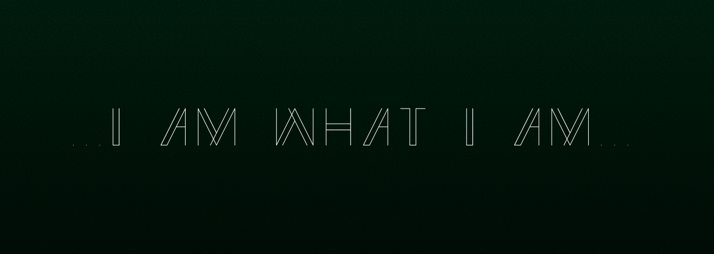

<!--Banner-->

<!--Night Owl image-->

  

<!--Header Name-->
#  𝐈'𝐦 𝐀𝐊 ... 
*Iam What Iam ...*
  

<!--Start Intro-->               

To Me, Programming Is The Art Of Creation — Giving Life To A Being Made Of 0s And 1s. It’s Where Logic Turns Into Soul, And Lines Of Code Breathe Into Something That Thinks, Reacts, And Reshapes The World ...

- ✨ Student Of life :)
- 🌱 I’m Currently Learning Many Things, I Believe That Everyday Is A Learning Opportunity ...
- ✍ I Write Technical Blogs, You Can Visit My Blog Site At [DEV](https://dev.to/theak)
- ❤ Contributing To Open Source
<!--End Intro-->

<!--Profile Count Badge-->

  

---

<!--Trophies Section-->   
<h2 align="center">🏆 𝐆𝐈𝐓𝐇𝐔𝐁 𝐓𝐑𝐎𝐏𝐇𝐈𝐄𝐒 🏆</h2>

  <a href="https://github.com/theakorg">
    <picture>
      <source media="(prefers-color-scheme: dark)" srcset="https://github-profile-trophy.vercel.app/?username=theakorg&no-bg=true&row=2&column=6&margin-w=20&margin-h=20&theme=monokai">
      <source media="(prefers-color-scheme: light)" srcset="https://github-profile-trophy.vercel.app/?username=theakorg&no-bg=true&row=2&column=6&margin-w=20&margin-h=20">
      
    </picture>
  </a>

 

<!--Github stats Table--> 
<h2 align="center">📊 𝐆𝐈𝐓𝐇𝐔𝐁 𝐒𝐓𝐀𝐓𝐒 📊</h2>

<table width="100%">
  <tr>
    <td width="50%">
      <h3 align="center"><strong>𝐆𝐈𝐓𝐇𝐔𝐁 𝐒𝐓𝐀𝐓𝐒</strong></h3>
      

        
      

    </td>
    <td width="50%">
      <h3 align="center"><strong>𝐒𝐓𝐑𝐄𝐀𝐊 𝐒𝐓𝐀𝐓𝐒</strong></h3>
      

        
      

    </td>
  </tr>
  <tr>
    <td width="50%">
      <h3 align="center"><strong>𝐋𝐀𝐓𝐄𝐒𝐓 𝐏𝐑𝐎𝐉𝐄𝐂𝐓</strong></h3>
      

        
      

    </td>
    <td width="50%">
      <h3 align="center"><strong>𝐓𝐎𝐏 𝐂𝐎𝐍𝐓𝐑𝐈𝐁𝐔𝐓𝐈𝐎𝐍𝐒</strong></h3>
      

        
      

    </td>
  </tr>
</table>
 

<!--Contribution Graph-->
<h2 align="center">📈 𝐂𝐎𝐍𝐓𝐑𝐈𝐁𝐔𝐓𝐈𝐎𝐍𝐒 𝐆𝐑𝐀𝐏𝐇 📈</h2>

    

---

<!--Dynamic Quote Card --> 
<h2 align="center">🌟 𝐓𝐇𝐎𝐔𝐆𝐇𝐓 𝐎𝐅 𝐓𝐇𝐄 𝐂𝐄𝐍𝐓𝐔𝐑𝐘 🌟</h2>

<!--Starts Here Quote CARD-->

    

<!--Ends Here Quote Card-->
